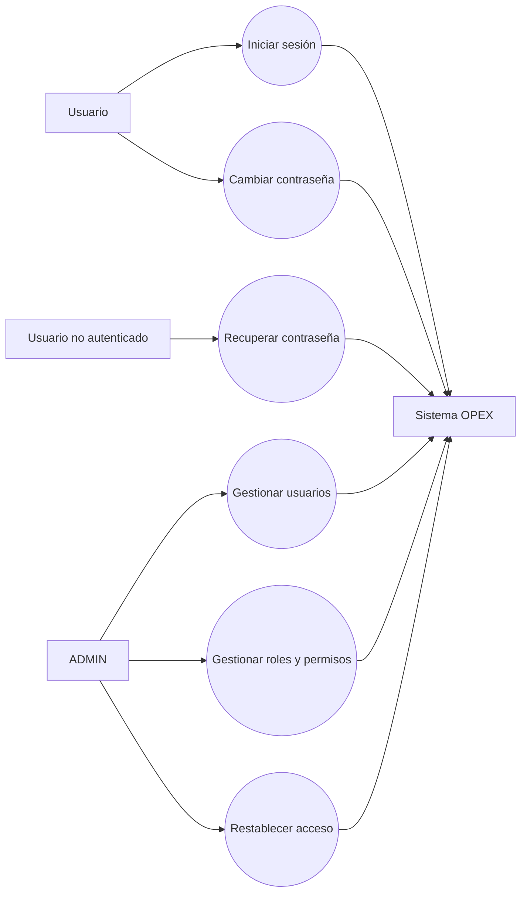
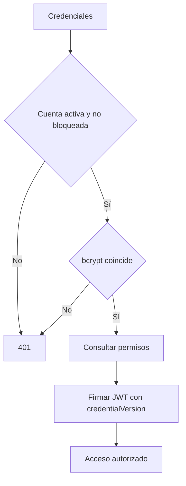
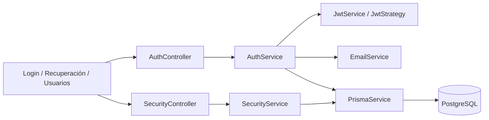

# Iteración I — Usuarios y Seguridad

## 1 Objetivo de la Iteración

Establecer la identidad, autenticación, autorización y administración de usuarios que sirven de base al sistema OPEX. La implementación vigente concentra estas responsabilidades en `AuthModule`, `UsersModule` y `SecurityModule`, sin sistemas paralelos.

## 2 Requerimientos generales del módulo

- Autenticar mediante correo y contraseña con bcrypt y JWT.
- Aplicar roles, permisos y guards a recursos protegidos.
- Administrar usuarios, roles, permisos y asignaciones.
- Activar, desactivar, bloquear y desbloquear cuentas.
- Recuperar, restablecer y cambiar contraseñas con token seguro, hash, expiración y uso único.
- Invalidar sesiones previas mediante `credentialVersion`.
- Auditar eventos de seguridad sin exponer contraseñas ni hashes.

## 3 Actores involucrados

| Actor | Participación implementada |
|---|---|
| Usuario autenticado | Inicia sesión y cambia su contraseña. |
| Usuario no autenticado | Solicita recuperación y utiliza el enlace recibido. |
| ADMIN | Administra usuarios, roles, permisos, estados y recuperación administrativa. |
| Sistema OPEX | Firma/verifica JWT, aplica RBAC, genera tokens y registra auditoría. |
| Servicio de correo | Abstracción `EmailService`; el transporte de desarrollo deja preparada la integración con proveedor. |

## 4 Caso de Uso General

**CU-I-01 Gestionar acceso seguro.** El usuario presenta credenciales; OPEX valida cuenta y contraseña, obtiene permisos y entrega un JWT. El administrador mantiene las identidades y el usuario puede recuperar o cambiar su contraseña.

## 5 Descripción funcional del módulo

`AuthService` autentica y firma un payload que contiene identidad, rol, empresa, permisos y versión de credenciales. `JwtStrategy` comprueba en cada petición que el usuario siga activo, no esté bloqueado y que la versión del JWT coincida. `SecurityService` gestiona usuarios y RBAC. La recuperación genera 32 bytes aleatorios, persiste sólo SHA-256 e invalida todos los tokens pendientes después del cambio.

El frontend dispone de login, solicitud de recuperación, restablecimiento, cambio personal, usuarios, roles, permisos y matriz de acceso. `ProtectedRoute`, `RoleProtectedRoute` y la navegación dinámica complementan —sin sustituir— la protección del backend.

## 6 Secuencia normal

1. El usuario introduce correo y contraseña.
2. `AuthController` delega en `AuthService`.
3. Se localiza `User` y se verifica bcrypt, actividad y bloqueo.
4. Se consultan `UserRole`, `RolePermission` y `Permission` activos.
5. Se firma el JWT incluyendo `credentialVersion`.
6. El frontend almacena token y datos no sensibles del usuario.
7. Las peticiones posteriores pasan por `JwtAuthGuard` y `JwtStrategy`.

## 7 Flujos alternativos

- Recuperación: se responde siempre con el mismo mensaje, exista o no la cuenta.
- Cambio autenticado: se exige contraseña actual, confirmación y política configurable.
- Administración: ADMIN genera enlace, establece contraseña temporal u obliga cambio posterior.
- Cuenta desactivada o bloqueada: no se emite JWT.

## 8 Excepciones

- Credenciales inválidas o cuenta no disponible: HTTP 401.
- Token JWT expirado o con versión anterior: HTTP 401.
- Token de recuperación usado, inexistente o expirado: HTTP 400 con mensaje controlado.
- Falta de permiso `SECURITY_*`: HTTP 403 mediante `requirePermission`.
- Confirmación diferente, contraseña actual incorrecta o reutilización: HTTP 400.

## 9 Reglas de negocio

1. Nunca se retorna `passwordHash`.
2. El token de recuperación se almacena únicamente como hash SHA-256.
3. Cada token tiene expiración configurable y se usa una sola vez.
4. Cambiar/restablecer contraseña invalida tokens pendientes y JWT anteriores.
5. La política predeterminada exige 10 caracteres, mayúscula, minúscula, número y símbolo.
6. Sólo usuarios con permisos de escritura de Seguridad ejecutan administración sensible.
7. El correo inexistente no puede inferirse a partir de la respuesta pública.

## 10 Diagrama de Casos de Uso



## 11 Diagrama de Flujo



## 12 Diagrama de Componentes



## 13 Mockups del módulo

Se reutilizan las pantallas reales: `/login`, `/olvide-contrasena`, `/restablecer-contrasena`, `/mi-perfil/seguridad`, `/security/users`, `/security/roles`, `/security/permissions` y `/security/access-matrix`. El mockup implementado conserva Chakra UI, indicadores de carga y mensajes de éxito/error.

## 14 Fragmentos principales del código implementado

Validación de sesión vigente (`jwt.strategy.ts`):

```ts
const current = await prisma.user.findUnique({ select: {
  active: true, blocked: true, credentialVersion: true
}});
if (!current || !current.active || current.blocked ||
    current.credentialVersion !== (payload.credentialVersion ?? 0))
  throw new UnauthorizedException('La sesión ya no es válida.');
```

Token no persistido en texto plano (`password-security.ts`):

```ts
export const createResetToken = () => randomBytes(32).toString('hex');
export const hashResetToken = (token: string) =>
  createHash('sha256').update(token).digest('hex');
```

## 15 Objetos creados

- **Entidades:** `User`, `Role`, `Permission`, `UserRole`, `RolePermission`, `PasswordResetToken`, `SecurityAudit`.
- **DTO:** `LoginDto`, `ForgotPasswordDto`, `ResetPasswordDto`, `ChangePasswordDto`, DTO de usuario/rol/permiso y `AdminResetPasswordDto`.
- **Controllers:** `AuthController`, `SecurityController`.
- **Services:** `AuthService`, `UsersService`, `SecurityService`, `EmailService`.
- **Repositories:** acceso centralizado mediante `PrismaService`; no existe repositorio específico.
- **Hooks:** no hay hooks propios de seguridad; las pantallas usan hooks React estándar.
- **Componentes:** `LoginPage`, `ForgotPasswordPage`, `ResetPasswordPage`, `ChangePasswordPage`, `UsersPage`, `RolesPage`, `PermissionsPage`, `AccessMatrixPage`.
- **Interfaces:** `AuthUser`, `LoginResponse`, tipos de seguridad frontend.
- **Guards:** `JwtAuthGuard`, `RolesGuard`, `RoleProtectedRoute`, `ProtectedRoute`.
- **Middlewares:** no existe middleware propio; se usa estrategia Passport y `ValidationPipe` global.

## 16 Base de datos

Tablas principales: `User`, `Role`, `Permission`, `UserRole`, `RolePermission`, `PasswordResetToken`, `SecurityAudit`. Relaciones N:M entre usuarios y roles y entre roles y permisos; tokens y auditorías referencian usuarios. Migraciones relevantes: `20260506161156_add_user_roles_hierarchy`, `20260506173326_add_user_roles_02` y `20260811203000_password_security`.

## 17 API REST

| Método | Ruta | Finalidad |
|---|---|---|
| POST | `/api/auth/login` | Autenticar. |
| POST | `/api/auth/forgot-password` | Solicitar recuperación. |
| POST | `/api/auth/reset-password` | Restablecer con token. |
| POST | `/api/auth/change-password` | Cambiar contraseña autenticada. |
| GET/POST/PATCH | `/api/security/users...` | Consultar, crear y modificar usuarios. |
| PATCH | `/api/security/users/:id/activate|deactivate|block|unblock` | Cambiar disponibilidad. |
| PATCH | `/api/security/users/:id/force-password-change` | Obligar cambio. |
| POST | `/api/security/users/:id/password-reset-link` | Generar enlace administrativo. |
| POST | `/api/security/users/:id/reset-password` | Restablecimiento administrativo. |
| GET/POST/PATCH | `/api/security/roles...`, `/permissions...` | Catálogos RBAC. |
| POST/DELETE | `/api/security/users/:userId/roles/:roleId` | Asignar/remover rol. |
| POST/DELETE | `/api/security/roles/:roleId/permissions/:permissionId` | Asignar/remover permiso. |
| GET | `/api/security/access-matrix` | Consultar matriz. |

## 18 Pruebas realizadas

`password-security.test.js` valida aleatoriedad/hash y política de contraseña. La regresión backend reportada actualmente ejecuta 71 pruebas aprobadas. También se verificaron build backend/frontend, Prisma validate/generate durante Sprint 8.1 y respuestas genéricas iguales para correo existente e inexistente.

## 19 Resultado de la Iteración

Quedó implementada una base de seguridad integrada: autenticación JWT, RBAC, administración, recuperación y auditoría. No existe refresh token ni almacenamiento de sesiones; la invalidación se logra mediante versión de credenciales. `EmailService` es una abstracción y requiere configurar un proveedor real para producción.
