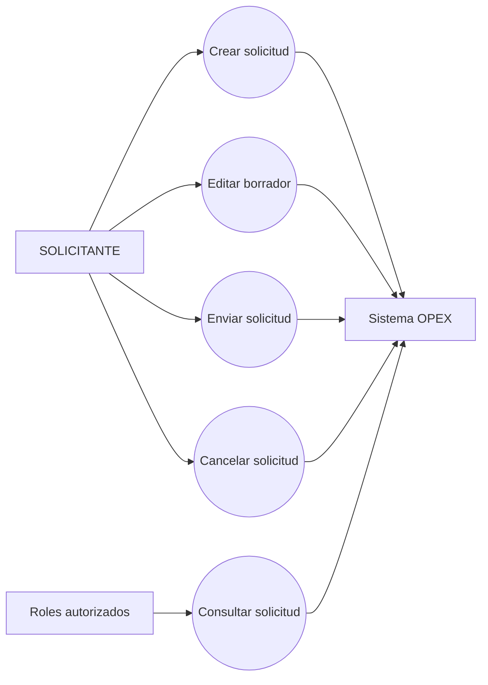
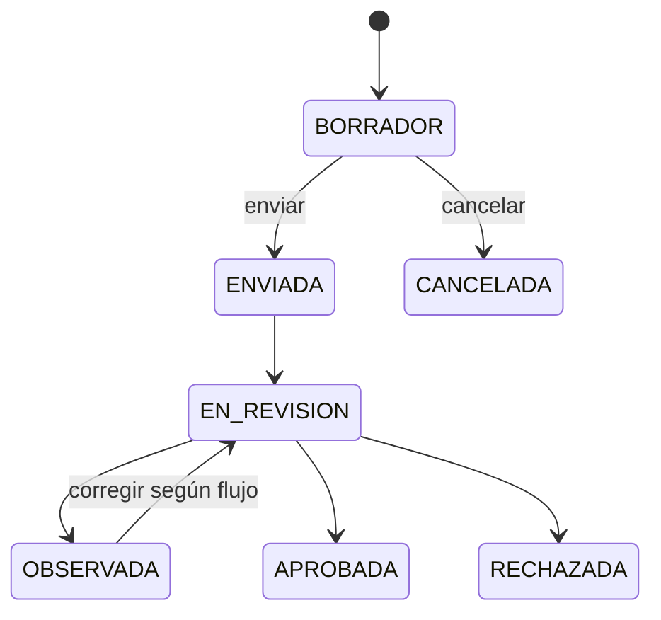
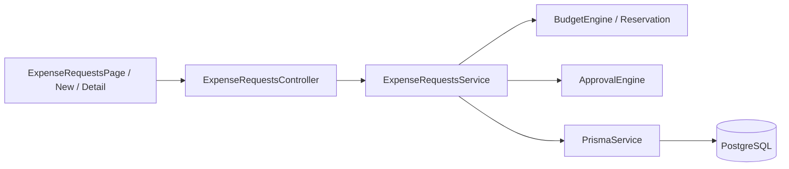

# Iteración II — Solicitudes de Gasto

## 1 Objetivo de la Iteración

Implementar el registro y seguimiento de solicitudes de gasto con identificación empresarial, partidas presupuestarias, conceptos, documentos y estados controlados.

## 2 Requerimientos generales del módulo

- Crear, listar, consultar y editar solicitudes.
- Registrar partidas y cantidades solicitadas.
- Asociar empresa, moneda, país, prioridad y solicitante.
- Someter y cancelar solicitudes conforme al estado.
- Consultar evaluación presupuestaria y trazas.
- Asociar documentos técnicos compatibles sin convertir esta relación en el vínculo de liquidación.

## 3 Actores involucrados

| Actor | Responsabilidad |
|---|---|
| SOLICITANTE | Crea, modifica, envía y consulta sus solicitudes. |
| GERENTE / FINANZAS / ADMIN | Consulta y participa en etapas posteriores autorizadas. |
| Sistema OPEX | Numera, valida, persiste, evalúa presupuesto y registra trazas. |

## 4 Caso de Uso General

**CU-II-01 Gestionar solicitud de gasto.** El solicitante captura cabecera y partidas, guarda un borrador, lo modifica si es necesario y lo envía. El sistema valida consistencia, presupuesto y transición de estado.

## 5 Descripción funcional del módulo

`ExpenseRequestsController` expone el ciclo de vida y `ExpenseRequestsService` concentra reglas, numeración por `DocumentSeries`, propiedad del solicitante, asociación de empresa/moneda y trazabilidad. La solicitud contiene una colección de `ExpenseRequestItem`, validaciones y eventos. El frontend ofrece listado, alta y detalle.

## 6 Secuencia normal

1. El usuario abre “Nueva solicitud”.
2. Selecciona empresa, moneda, partida presupuestaria y agrega conceptos.
3. El frontend envía `CreateExpenseRequestDto`.
4. El backend valida catálogos, identidad y montos.
5. Se genera código mediante serie documental y se guarda en BORRADOR.
6. El solicitante revisa y ejecuta “Enviar”.
7. Se evalúan reglas y presupuesto y se inicia el flujo posterior cuando corresponde.

## 7 Flujos alternativos

- Guardar en borrador y continuar posteriormente.
- Editar datos antes de enviar.
- Cancelar una solicitud en estado permitido.
- Consultar observaciones y corregir según el flujo de aprobación.
- Asociar documentos técnicos mediante el endpoint histórico compatible.

## 8 Excepciones

- Solicitud inexistente: HTTP 404.
- Usuario sin acceso a la solicitud: HTTP 403.
- Datos no permitidos por DTO: HTTP 400 por `ValidationPipe`.
- Moneda, empresa o partida inexistentes/inactivas: rechazo controlado.
- Transición desde estado no permitido: HTTP 400.

## 9 Reglas de negocio

1. Una solicitud pertenece a una empresa y a un solicitante.
2. Las partidas determinan el monto solicitado.
3. Sólo el propietario o roles privilegiados consultan/modifican conforme al servicio.
4. El envío deja de tratar el registro como borrador editable libremente.
5. La relación funcional de facturas justificativas no se realiza aquí, sino en Liquidación.
6. Los códigos siguen la serie documental configurada.

## 10 Diagrama de Casos de Uso



## 11 Diagrama de Flujo



## 12 Diagrama de Componentes



## 13 Mockups del módulo

Pantallas reales: `/solicitudes-gastos`, `/solicitudes-gastos/nueva` y `/solicitudes-gastos/:id`. Incluyen búsqueda/listado, formulario con partidas y detalle de estado, validaciones y acciones disponibles.

## 14 Fragmentos principales del código implementado

Rutas principales (`expense-requests.controller.ts`):

```ts
@Post() create(@Body() dto: CreateExpenseRequestDto, @Req() req: any)
@Patch(':id/submit') submit(@Param('id') id: string, @Req() req: any)
@Patch(':id/cancel') cancel(@Param('id') id: string, @Req() req: any)
```

Relación conceptual persistida:

```prisma
model ExpenseRequest {
  requesterId String
  companyId   String?
  items       ExpenseRequestItem[]
  validations ExpenseRequestValidation[]
  traces      ExpenseRequestTrace[]
}
```

## 15 Objetos creados

- **Entidades:** `ExpenseRequest`, `ExpenseRequestItem`, `ExpenseRequestValidation`, `ExpenseRequestTrace`, `DocumentSeries`.
- **DTO:** `CreateExpenseRequestDto` y estructuras de partidas.
- **Controllers:** `ExpenseRequestsController`.
- **Services:** `ExpenseRequestsService`.
- **Repositories:** `PrismaService`; integración con `BudgetRepository` mediante servicios presupuestarios.
- **Hooks:** hooks React estándar; no existe hook de dominio propio.
- **Componentes:** `ExpenseRequestsPage`, `NewExpenseRequestPage`, `ExpenseRequestDetailPage`, `SearchableSelect`.
- **Interfaces:** payloads y tipos en servicios frontend y DTO backend.
- **Guards:** `JwtAuthGuard`; autorización adicional dentro del servicio.
- **Middlewares:** no hay middleware propio; `ValidationPipe` global.

## 16 Base de datos

Tablas: `ExpenseRequest`, `ExpenseRequestItem`, `ExpenseRequestValidation`, `ExpenseRequestTrace`, `Company`, `Currency`, `Country`, `DocumentSeries`, `BudgetLine`, `BudgetReservation`. Relaciones 1:N con partidas, validaciones y trazas; relaciones opcionales con catálogos y presupuesto. Migraciones: `20260428210535_add_expense_requests`, `20260429201221_add_company_currency_document_series`, `20260504170443_add_country_to_expense_request`, además de ampliaciones presupuestarias posteriores.

## 17 API REST

| Método | Ruta | Finalidad |
|---|---|---|
| POST | `/api/expense-requests` | Crear solicitud. |
| GET | `/api/expense-requests` | Listar solicitudes visibles. |
| GET | `/api/expense-requests/:id` | Consultar detalle. |
| PATCH | `/api/expense-requests/:id` | Modificar en estado permitido. |
| PATCH | `/api/expense-requests/:id/submit` | Enviar. |
| PATCH | `/api/expense-requests/:id/cancel` | Cancelar. |
| PATCH | `/api/expense-requests/:id/documents` | Asociación técnica compatible. |
| GET | `/api/budget/requests/:id/evaluation` | Consultar evaluación presupuestaria. |

## 18 Pruebas realizadas

Las reglas presupuestarias asociadas se cubren en `budget-engine.test.js`; las pruebas de regresión incluyen estados, disponibilidad mensual/anual y moneda. Las pruebas funcionales verificadas durante el proyecto incluyen creación, envío, aprobación y posterior desembolso. Build backend/frontend aprobado en la validación vigente.

## 19 Resultado de la Iteración

Quedó implementado el ciclo base de solicitudes con catálogos, partidas, estados, propiedad, trazabilidad e integración con presupuesto/aprobación. El documento OCR puede existir sin solicitud y su justificación definitiva se realiza desde Liquidación, preservando la arquitectura multiempresa.
