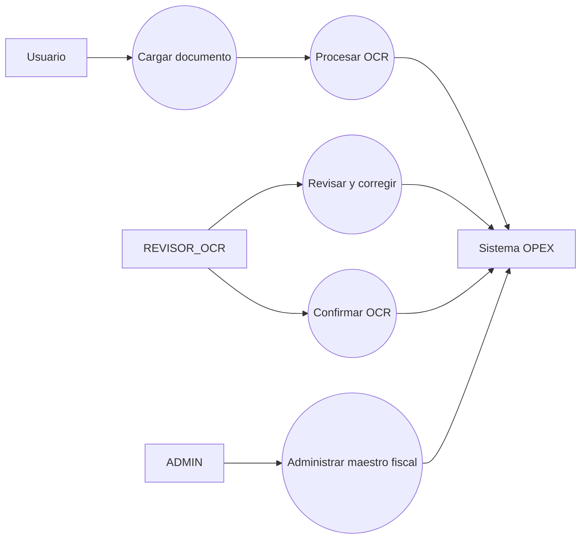
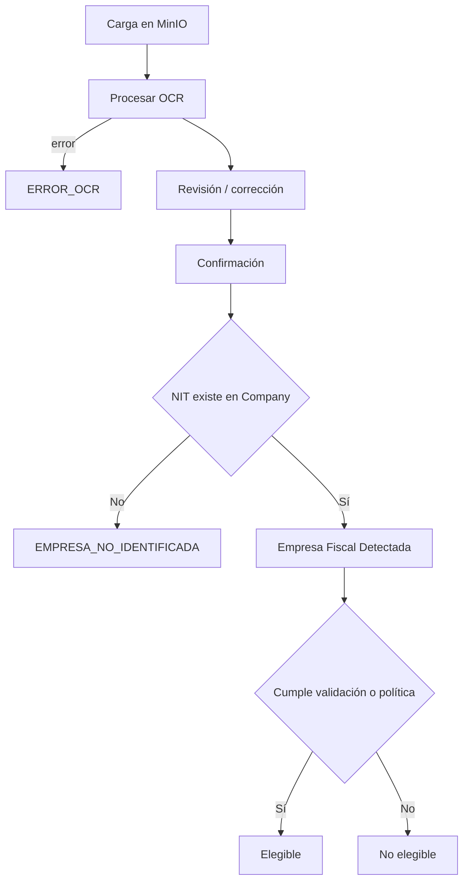
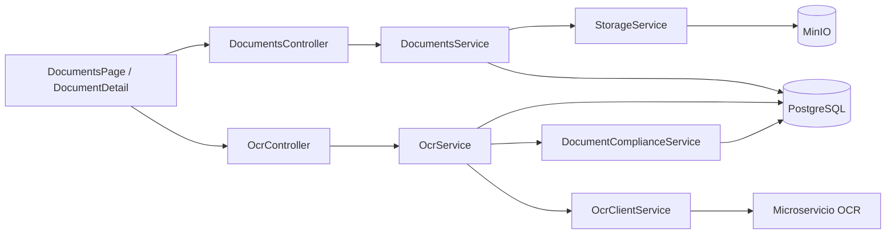

# Iteración III — OCR y Centro Documental

## 1 Objetivo de la Iteración

Centralizar la carga documental, extracción OCR, revisión humana, validación fiscal multiempresa y determinación de elegibilidad de comprobantes sin exigir una solicitud de gasto para que el documento exista.

## 2 Requerimientos generales del módulo

- Cargar archivos en el repositorio documental MinIO/S3.
- Procesar PDF e imágenes mediante el microservicio OCR.
- Conservar texto, campos, líneas, métricas, confianza y errores.
- Permitir correcciones manuales sin reprocesar cuando aplica.
- Confirmar la revisión y evaluar cumplimiento fiscal/políticas.
- Detectar empresa fiscal por NIT del receptor, nunca por empresa del usuario.
- Mantener documentos no identificados y evitar su pérdida.
- Marcar elegibilidad y uso único para liquidaciones.

## 3 Actores involucrados

| Actor | Participación |
|---|---|
| SOLICITANTE | Carga y consulta documentos; corrige datos autorizados. |
| REVISOR_OCR | Revisa campos, líneas, receptor fiscal y confirma resultados. |
| ADMIN | Supervisa documentos, métricas, políticas y maestro fiscal. |
| Microservicio OCR | Extrae texto y estructura documental. |
| MinIO/S3 | Conserva archivos binarios. |
| Sistema OPEX | Orquesta OCR, auditoría, validación fiscal y elegibilidad. |

## 4 Caso de Uso General

**CU-III-01 Procesar comprobante.** Un usuario carga un archivo; OPEX lo almacena, solicita OCR, persiste los resultados y permite revisión/corrección. Finalmente identifica la empresa receptora y determina si será elegible para una liquidación futura.

## 5 Descripción funcional del módulo

`DocumentsService` administra metadatos y almacenamiento. `OcrService` coordina estados, resultados, correcciones, confirmación y métricas. `OcrClientService` consume el microservicio configurable con timeout. `DocumentComplianceService` evalúa tipo documental, receptor, NIT, empresa fiscal y políticas. La arquitectura final mantiene `Document` independiente y enlaza su utilización por `ExpenseSettlementDocument`.

## 6 Secuencia normal

1. El usuario carga PDF/JPG/PNG u otro MIME permitido.
2. `StorageService` guarda el archivo y `Document` queda CARGADO.
3. Se invoca `POST /ocr/:documentId`.
4. El microservicio devuelve texto, confianza, importes, receptor y líneas.
5. OPEX persiste `OCRResult` y campos extraídos.
6. El revisor corrige datos necesarios y confirma.
7. Se busca `receiverTaxId` en `Company.taxId`.
8. Se registra empresa detectada y decisión de cumplimiento.
9. El documento queda elegible sólo si cumple todas las reglas.

## 7 Flujos alternativos

- OCR sin NIT: documento queda `EMPRESA_NO_IDENTIFICADA`.
- NIT inexistente: se conserva con mensaje “NIT receptor no registrado en el Maestro Fiscal”.
- Corrección manual: se reidentifica empresa sin ejecutar OCR nuevamente.
- Diferencia menor de razón social: se genera advertencia, no rechazo automático si coincide NIT.
- Tipo RECIBO u OTRO: puede autorizarse mediante Policy Engine.

## 8 Excepciones

- Error/timeout del microservicio: `ERROR_OCR`, con mensaje persistido.
- Archivo ausente o no permitido: HTTP 400/404.
- Documento no revisado/confirmado: no elegible.
- Empresa fiscal diferente a la solicitud de la liquidación: vinculación rechazada.
- Documento ya usado: no puede seleccionarse nuevamente.

## 9 Reglas de negocio

1. `expenseRequestId` no es obligatorio para que exista un documento OCR.
2. La empresa inicial se identifica exclusivamente con datos fiscales del documento.
3. NIT es criterio principal; razón social es complementaria.
4. Una corrección manual no relanza OCR.
5. Un documento no confirmado, rechazado o sin empresa identificada no es elegible.
6. `usedInSettlement` y la relación única impiden doble utilización.
7. Los archivos continúan en el repositorio documental existente.

## 10 Diagrama de Casos de Uso



## 11 Diagrama de Flujo



## 12 Diagrama de Componentes



## 13 Mockups del módulo

Pantallas reales: `/rendicion-conciliacion/ocr/documentos`, detalle `/rendicion-conciliacion/ocr/documentos/:id`, dashboard `/rendicion-conciliacion/ocr/dashboard`, reportes OCR y maestro fiscal `/configuracion/empresas-fiscales`. Los paneles implementados son `OcrReviewPanel`, `OcrFieldsEditor` y `FiscalDecisionPanel`.

## 14 Fragmentos principales del código implementado

Identificación desacoplada, representada por campos persistidos:

```prisma
receiverTaxId String?
fiscalCompanyId String?
fiscalCompanyIdentificationMethod FiscalCompanyIdentificationMethod?
fiscalCompanyIdentificationStatus FiscalCompanyIdentificationStatus
eligibleForSettlement Boolean @default(false)
usedInSettlement Boolean @default(false)
```

Corrección de total sin reprocesar:

```ts
@Put(':documentId/total')
updateTotal(@Param('documentId') id: string, @Body() dto: UpdateTotalDto)
```

## 15 Objetos creados

- **Entidades:** `Document`, `OCRResult`, `ExtractedField`, `OCRFieldCorrection`, `OCRValidationRun`, `OCRComplianceDecision`, `ExtractedExtraField`, `ExtractedLineItem`, `OCRConfirmation`, `Company`.
- **DTO:** carga/listado, `ConfirmOcrDto`, `UpdateFieldsDto`, `UpdateLineItemsDto`, `UpdateTotalDto`, `CreateValidationRunDto`.
- **Controllers:** `DocumentsController`, `OcrController`, catálogo de empresas.
- **Services:** `DocumentsService`, `StorageService`, `OcrService`, `OcrClientService`, `DocumentComplianceService`.
- **Repositories:** `PrismaService`; `StorageService` implementa la abstracción documental.
- **Hooks:** hooks React estándar.
- **Componentes:** `DocumentsPage`, `DocumentDetailPage`, `OcrReviewPanel`, `OcrFieldsEditor`, `FiscalDecisionPanel`, `OcrAnalyticsPage`, `FiscalCompaniesPage`.
- **Interfaces:** `StorageRepository`, contratos OCR y tipos frontend.
- **Guards:** `JwtAuthGuard` y verificaciones de rol del módulo.
- **Middlewares:** Multer mediante `FileInterceptor`; `ValidationPipe` global.

## 16 Base de datos

Tablas listadas en objetos creados y relación opcional `Document.expenseRequestId` conservada por compatibilidad histórica. La relación funcional de uso está en `ExpenseSettlementDocument.documentId` único. Migraciones OCR: `20260420173751_init_ocr_module`, `20260421170810_orc_v2`, `20260810190000_ocr_field_audit`, `20260810210000_ocr_processing_metrics`, `20260810223000_ocr_ux_audit_metrics`, `20260811003000_ocr_fiscal_validation`, `20260811170000_ocr_multi_company_document_center` y `20260811183000_settlement_document_architecture`.

## 17 API REST

| Método | Ruta | Finalidad |
|---|---|---|
| POST | `/api/documents/upload` | Cargar archivo. |
| GET | `/api/documents` | Listar Centro Documental. |
| GET | `/api/documents/:id` | Consultar detalle. |
| GET | `/api/documents/:id/file` | Obtener archivo. |
| POST | `/api/ocr/:documentId` | Procesar OCR. |
| GET | `/api/ocr/:documentId/result` | Consultar resultado. |
| PUT | `/api/ocr/:documentId/fields` | Corregir campos fiscales. |
| PUT | `/api/ocr/:documentId/total` | Corregir total. |
| PUT | `/api/ocr/:documentId/items` | Corregir líneas. |
| POST | `/api/ocr/:documentId/confirm` | Confirmar revisión. |
| POST | `/api/ocr/:documentId/validation-runs` | Ejecutar/registrar validación. |
| POST | `/api/ocr/:documentId/validate-compliance` | Evaluar cumplimiento. |
| GET | `/api/ocr/analytics/metrics` | Métricas OCR. |

## 18 Pruebas realizadas

`ocr-client.test.js` cubre contrato y timeout; `ocr-service.test.js` cubre éxito/error; `ocr-fiscal-validation.test.js` contiene 20 casos de tipo, NIT, confianza, políticas, independencia, corrección manual y empresa detectada. La regresión actual reporta 71/71 pruebas backend aprobadas.

## 19 Resultado de la Iteración

Quedó implementado un Centro Documental independiente, auditable y multiempresa, con almacenamiento único, OCR revisable, validación fiscal y elegibilidad controlada. Los documentos no identificados se conservan y pueden corregirse posteriormente.
