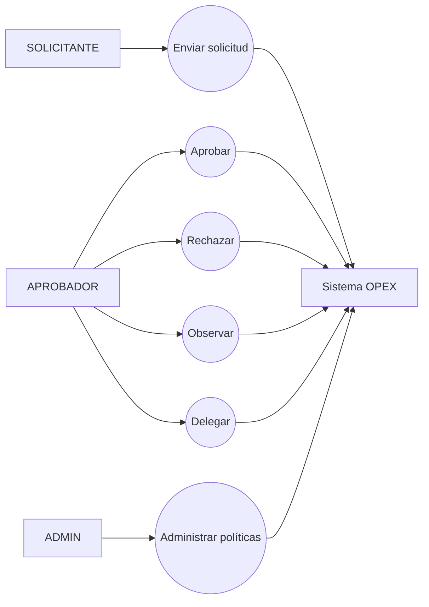
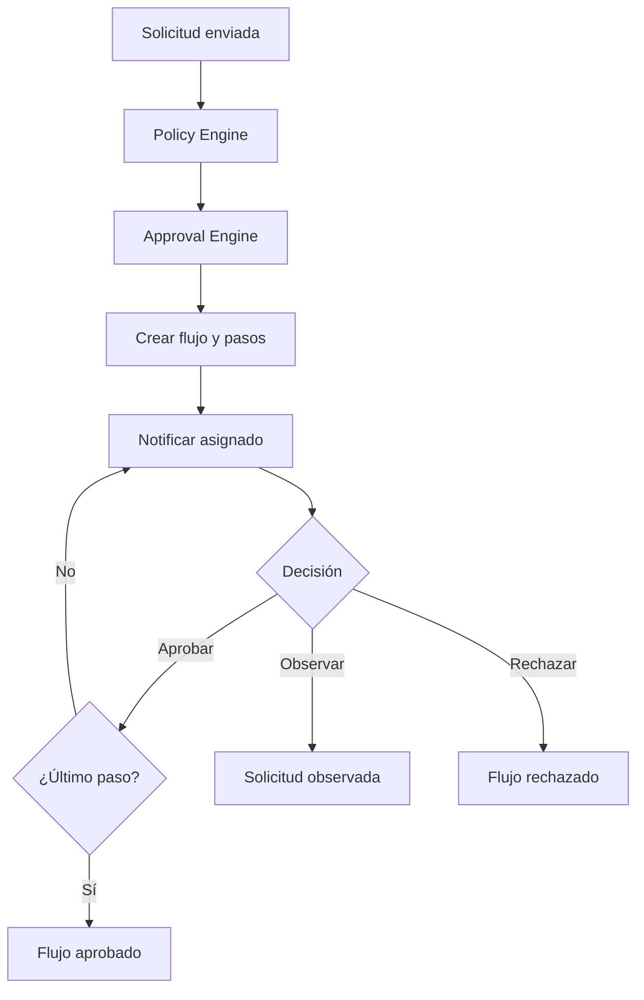
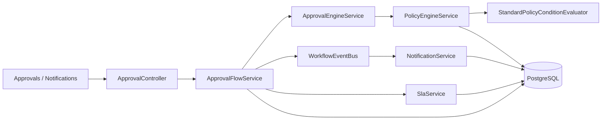

# Iteración IV — Aprobación por Roles

## 1 Objetivo de la Iteración

Automatizar decisiones y aprobaciones por roles mediante reglas configurables, flujos trazables, SLA y notificaciones internas.

## 2 Requerimientos generales del módulo

- Evaluar solicitudes mediante Policy Engine.
- Construir flujos con Approval Engine y pasos ordenados.
- Aprobar, rechazar, observar, delegar, reasignar y cancelar.
- Respetar usuarios/roles asignados y segregación de funciones.
- Registrar historial completo y estados.
- Notificar eventos y medir SLA.
- Permitir simulación y administración de políticas.

## 3 Actores involucrados

| Actor | Participación |
|---|---|
| SOLICITANTE | Envía y corrige; recibe notificaciones. |
| GERENTE | Atiende pasos asignados conforme al flujo. |
| FINANZAS | Revisa/aprueba cuando la política lo determina. |
| ADMIN | Administra reglas y puede intervenir según autorizaciones implementadas. |
| Sistema OPEX | Evalúa políticas, genera pasos, eventos, SLA y notificaciones. |

## 4 Caso de Uso General

**CU-IV-01 Procesar aprobación.** Tras el envío de una solicitud, el Policy Engine produce decisiones; el Approval Engine materializa pasos. El aprobador asignado decide y el sistema avanza, notifica y audita.

## 5 Descripción funcional del módulo

`PolicyEngineService` evalúa condiciones mediante `PolicyConditionEvaluator`. `ApprovalEngineService` crea el diseño de aprobación y `ApprovalFlowService` ejecuta el ciclo. `WorkflowEventBusService` desacopla eventos; `NotificationService` usa el canal interno y `SlaService` calcula semáforos y vencimientos. Las pantallas reales integran aprobaciones, notificaciones y trazabilidad.

## 6 Secuencia normal

1. Una solicitud enviada activa evaluación.
2. Se cargan políticas activas aplicables.
3. Cada condición compara campo, operador y valor.
4. El motor determina resultado y pasos requeridos.
5. Se crea `ApprovalFlow` y sus `ApprovalStep`.
6. El aprobador consulta pendientes y aprueba.
7. El flujo avanza al siguiente paso o finaliza.
8. Se actualiza la solicitud y se emiten notificaciones/eventos.

## 7 Flujos alternativos

- Rechazo con comentario.
- Observación y devolución para corrección.
- Delegación temporal de un paso.
- Reasignación autorizada.
- Cancelación del flujo.
- Simulación de política sin persistir una solicitud.
- Escalamiento de SLA desde trazabilidad.

## 8 Excepciones

- Usuario distinto al asignado intenta decidir: HTTP 403.
- Paso no pendiente o flujo finalizado: HTTP 400.
- Rechazo/observación sin comentario requerido: HTTP 400.
- Política inválida o condición no soportada: validación controlada.
- Flujo/solicitud inexistente: HTTP 404.

## 9 Reglas de negocio

1. Sólo el paso pendiente vigente puede decidirse.
2. Los pasos respetan orden y asignación.
3. Las políticas activas y vigentes determinan acciones.
4. Toda decisión conserva usuario, fecha, comentario y transición.
5. SLA usa prioridad y reglas configuradas.
6. Las notificaciones internas no sustituyen la seguridad del endpoint.
7. Policy Engine y Approval Engine son servicios únicos reutilizados por los módulos.

## 10 Diagrama de Casos de Uso



## 11 Diagrama de Flujo



## 12 Diagrama de Componentes



## 13 Mockups del módulo

Pantallas reales: `/trazabilidad-flujos/autorizaciones`, `/notificaciones`, `/notificaciones/:id`, `/politicas-reglas`, monitor de estados y escalamiento SLA. Incluyen bandeja de pendientes, acciones de decisión, historial, semáforo y detalle.

## 14 Fragmentos principales del código implementado

Contrato de acciones (`approval.controller.ts`):

```ts
@Post(':id/approve') approve(...)
@Post(':id/reject') reject(...)
@Post(':id/observe') observe(...)
@Post(':id/delegate') delegate(...)
```

Relación de pasos:

```prisma
model ApprovalFlow { expenseRequestId String @unique; steps ApprovalStep[] }
model ApprovalStep { order Int; status ApprovalStepStatus; assignedUserId String? }
```

## 15 Objetos creados

- **Entidades:** `PolicyRule`, `PolicyApprovalStep`, `ApprovalFlow`, `ApprovalStep`, `Notification`, `SlaRule`, trazas de solicitud.
- **DTO:** `ApprovalActionDto`, DTO de políticas.
- **Controllers:** `ApprovalController`, `PoliciesController`, `NotificationsController`, `SlaController`, `TraceabilityController`.
- **Services:** `ApprovalEngineService`, `ApprovalFlowService`, `PolicyEngineService`, `PoliciesService`, `WorkflowEventBusService`, `NotificationService`, `SlaService`, `TraceabilityService`.
- **Repositories:** persistencia mediante `PrismaService`.
- **Hooks:** React estándar y consultas de servicios.
- **Componentes:** `ApprovalsPage`, `NotificationsPage`, `NotificationDetailPage`, `PoliciesRulesPage`, `StatusMonitorPage`, `SlaEscalationsPage`, `EventLogsPage`.
- **Interfaces:** evaluador de condiciones, canal de notificación, tipos de motores/eventos.
- **Guards:** `JwtAuthGuard`, comprobaciones de asignación/rol en servicios.
- **Middlewares:** no hay middleware propio.

## 16 Base de datos

Tablas: `PolicyRule`, `PolicyApprovalStep`, `ApprovalFlow`, `ApprovalStep`, `Notification`, `SlaRule`, `ExpenseRequestTrace`. Migraciones: `20260801180000_add_policy_rules`, `20260801193000_add_approval_engine`, `20260803120000_add_workflow_notifications_sla`.

## 17 API REST

| Grupo | Endpoints implementados |
|---|---|
| Aprobaciones | `GET /approval-flows/pending/me`, `GET /request/:requestId`, `GET /:id`, `GET /:id/history`, `POST /:id/approve|reject|observe|delegate|cancel`, `PATCH /:id/steps/:stepId/reassign`. |
| Políticas | `GET/POST /policies`, `GET/PATCH/DELETE /policies/:id`, `POST /policies/simulate`, `PATCH /:id/activate|deactivate`. |
| Notificaciones | `GET /notifications`, `/latest`, `/unread-count`, `/:id`; `PATCH /read-all`, `/:id/read`. |
| SLA | `GET /workflow/sla/rules`, `/pending/me`, `/flow/:id`. |
| Trazabilidad | autorizaciones, monitor, escalamiento y bitácora bajo `/api/traceability`. |

## 18 Pruebas realizadas

La implementación se valida por regresión del flujo de solicitudes, presupuesto y liquidaciones que dependen de aprobaciones. Las pruebas funcionales documentadas cubren aprobación, rechazo, observación, pendientes y SLA. La suite vigente completa reporta 71 pruebas backend aprobadas; no existe un archivo unitario exclusivo del Approval Engine en `backend/test`.

## 19 Resultado de la Iteración

Quedó implementada una cadena configurable y trazable de políticas, aprobaciones, eventos, notificaciones y SLA. Las decisiones se mantienen separadas de las reglas de presupuesto, OCR y liquidación, que consumen los motores existentes.
