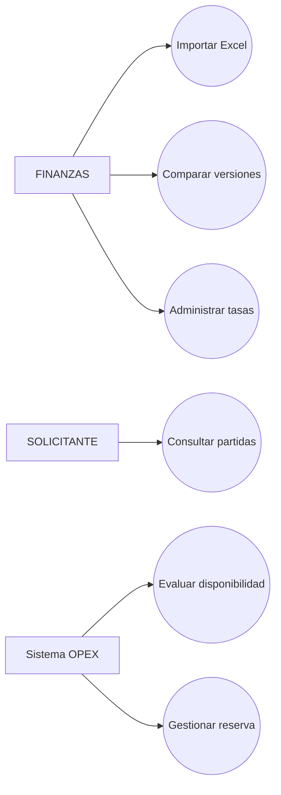
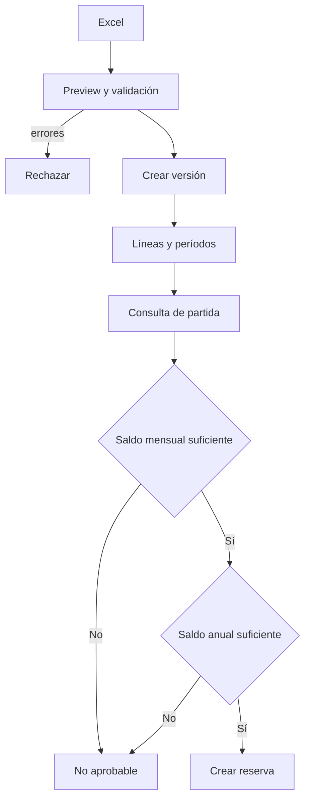
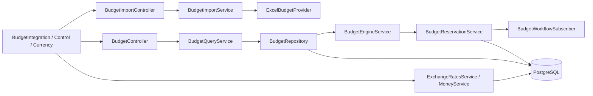

# Iteración V — Integración y Control Presupuestario

## 1 Objetivo de la Iteración

Proveer una fuente presupuestaria versionada, multimoneda y consultable para evaluar solicitudes, reservar fondos y producir información de control.

## 2 Requerimientos generales del módulo

- Importar presupuesto desde Excel con vista previa.
- Conservar versiones y comparar cargas.
- Consultar líneas, períodos y filtros.
- Evaluar disponibilidad mensual y anual.
- Reservar y liberar fondos conforme al workflow.
- Administrar monedas y tasas históricas.
- Convertir importes con redondeo consistente.
- Ofrecer reportes y exportaciones presupuestarias.

## 3 Actores involucrados

| Actor | Participación |
|---|---|
| FINANZAS | Importa, consulta y controla presupuesto y tasas. |
| ADMIN | Administra catálogos y tiene acceso amplio. |
| GERENTE | Consulta información y reportes autorizados. |
| SOLICITANTE | Selecciona partidas disponibles al crear solicitudes. |
| Sistema OPEX | Evalúa, convierte, reserva y actualiza saldos. |

## 4 Caso de Uso General

**CU-V-01 Controlar disponibilidad presupuestaria.** Finanzas importa una versión; OPEX valida líneas y períodos. Una solicitud consulta disponibilidad y, al avanzar el flujo, se crea o actualiza la reserva correspondiente.

## 5 Descripción funcional del módulo

El módulo separa fuente, importación, consulta, evaluación y reserva. `ExcelBudgetProvider` interpreta archivos; `BudgetImportService` administra preview/versiones; `BudgetEngineService` decide suficiencia; `BudgetReservationService` persiste compromisos y `BudgetWorkflowSubscriber` reacciona a eventos. `MoneyService` usa tasas vigentes por fecha y par de monedas.

## 6 Secuencia normal

1. Finanzas carga un Excel para vista previa.
2. Se validan estructura, catálogos, duplicados y montos.
3. Se confirma la importación y se crea `BudgetVersion`.
4. Se guardan líneas y períodos mensuales.
5. El solicitante consulta partidas disponibles por empresa/moneda.
6. La solicitud se evalúa contra saldo mensual y anual.
7. El workflow crea, confirma, libera o consume la reserva.

## 7 Flujos alternativos

- Consultar versiones anteriores y comparar cambios.
- Usar fuente Oracle JDE a través de la interfaz preparada; la implementación activa documentada incluye proveedor Excel.
- Convertir entre USD, GTQ, EUR u otras monedas configuradas.
- Misma moneda: tasa 1 sin consulta externa.
- Desactivar una tasa o moneda desde sus catálogos autorizados.

## 8 Excepciones

- Archivo o estructura inválida: HTTP 400.
- Línea duplicada o catálogo inexistente: rechazo de importación.
- Falta de presupuesto mensual/anual: evaluación insuficiente.
- Tasa no configurada/vigente: operación rechazada.
- Conversión entre la misma moneda con tasa explícita: validación rechazada.
- Acceso a importación por rol no autorizado: HTTP 403.

## 9 Reglas de negocio

1. Debe existir presupuesto mensual suficiente; el anual no anticipa fondos del mes.
2. También se controla el límite anual.
3. Cada versión conserva su origen y estado.
4. Sólo una versión activa se usa conforme a empresa, ejercicio y moneda.
5. Las tasas son históricas y se seleccionan por fecha efectiva.
6. Misma moneda equivale a tasa 1.
7. La conversión monetaria redondea HALF_UP a dos decimales.
8. Las reservas se coordinan con eventos del workflow.

## 10 Diagrama de Casos de Uso



## 11 Diagrama de Flujo



## 12 Diagrama de Componentes



## 13 Mockups del módulo

Pantallas reales: `/integracion-presupuestaria`, `/control-presupuestario`, `/configuracion/monedas-tasas`, selección de partida en `/solicitudes-gastos/nueva` y reporte `/reportes/presupuesto`. Usan filtros, tablas, tarjetas, buscador de partidas y comparaciones.

## 14 Fragmentos principales del código implementado

Regla probada del motor:

```ts
const monthlyAvailable = monthlyApproved - monthlyReserved - monthlyExecuted;
const annualAvailable = annualApproved - annualReserved - annualExecuted;
// La solicitud requiere suficiencia mensual y anual.
```

Conversión desacoplada:

```ts
await money.convert(amount, fromCurrencyId, toCurrencyId, operationDate);
```

## 15 Objetos creados

- **Entidades:** `BudgetVersion`, `BudgetLine`, `BudgetPeriod`, `BudgetReservation`, `Currency`, `ExchangeRate`, `ExchangeRateAudit`.
- **DTO:** `BudgetQueryDto`, `AvailableBudgetQueryDto`, `ExchangeRateQueryDto` y DTO de creación/actualización de tasa.
- **Controllers:** `BudgetController`, `BudgetImportController`, `ExchangeRatesController`, `CatalogController`.
- **Services:** `BudgetImportService`, `BudgetQueryService`, `BudgetEngineService`, `BudgetReservationService`, `BudgetWorkflowSubscriber`, `ExchangeRatesService`, `MoneyService`.
- **Repositories:** `BudgetRepository`.
- **Hooks:** React Query en Dashboard; hooks estándar en pantallas presupuestarias.
- **Componentes:** `BudgetIntegrationPage`, `BudgetControlPage`, `CurrenciesExchangeRatesPage`, `SearchableSelect`, `BudgetReportPage`.
- **Interfaces:** `BudgetSourceProvider`, tipos de evaluación/fuente, interfaces de servicios frontend.
- **Guards:** `JwtAuthGuard` y autorización por rol en importación/rutas.
- **Middlewares:** `FileInterceptor` para Excel.

## 16 Base de datos

Tablas: `BudgetVersion`, `BudgetLine`, `BudgetPeriod`, `BudgetReservation`, `Currency`, `ExchangeRate`, `ExchangeRateAudit`, además de referencias desde `ExpenseRequest`. Migraciones: `20260803160000_add_budget_integration`, `20260808170000_budget_line_request_month_control`, `20260808193000_budget_currencies_exchange_rates`, `20260808203000_active_budget_per_currency`.

## 17 API REST

| Grupo | Endpoints |
|---|---|
| Importación | `POST /api/budget-imports/preview`, `POST /api/budget-imports`, `GET /versions`, `GET /versions/:id`, `GET /versions/:currentId/compare/:previousId`. |
| Consulta | `GET /api/budget/available-lines`, `/filters`, `/lines`, `/lines/:id`, `/requests/:id/evaluation`. |
| Tasas | `GET /api/exchange-rates`, `/current`, `POST /api/exchange-rates`, `PATCH /api/exchange-rates/:id`. |
| Monedas | CRUD bajo `/api/catalog/currencies`. |
| Reportes | `GET /api/reports/budget` y `/api/reports/budget/export/:format`. |

## 18 Pruebas realizadas

`budget-engine.test.js` cubre suficiencia mensual/anual y moneda. `money.service.test.js`, `exchange-rates.integration.js` y `catalog-exchange-rates.test.js` validan tasas, conversiones, redondeo, vigencia y duplicados. Los 71 casos backend vigentes pasan en conjunto.

## 19 Resultado de la Iteración

Quedó implementada una integración presupuestaria versionada, consultable y conectada al workflow, con reservas y conversión monetaria auditable. El proveedor Oracle JDE está representado por una implementación preparada, mientras el flujo operativo de importación disponible usa Excel.
