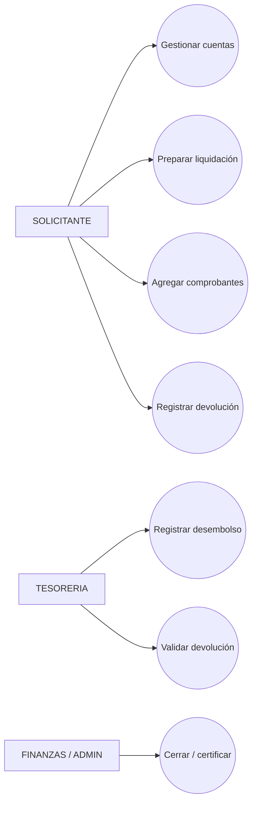
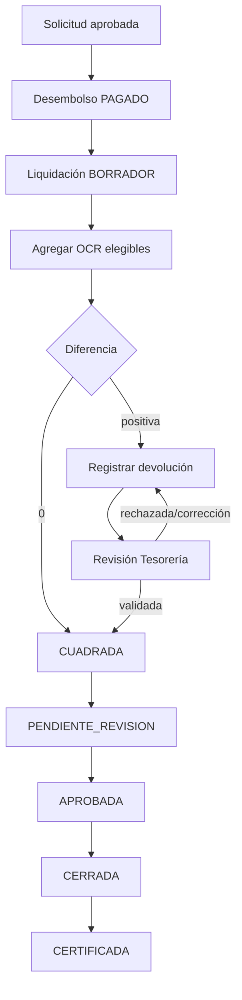
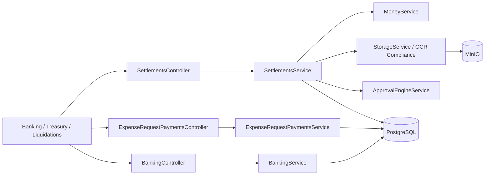

# Iteración VI — Liquidación y Conciliación

## 1 Objetivo de la Iteración

Rendir los fondos desembolsados mediante comprobantes OCR y devoluciones validadas, separando los estados de cuadratura, aprobación, cierre y certificación.

## 2 Requerimientos generales del módulo

- Administrar cuentas bancarias del solicitante y catálogo de bancos.
- Registrar desembolsos manuales sobre la API única existente.
- Validar moneda exacta entre solicitud, desembolso y cuenta.
- Crear liquidaciones desde solicitudes pagadas.
- Seleccionar comprobantes elegibles del Centro Documental.
- Evitar reutilización y validar empresa fiscal.
- Registrar devoluciones con evidencia MinIO y revisión de Tesorería.
- Calcular diferencia, cuadratura, aprobación, cierre y certificación.
- Auditar todas las acciones relevantes.

## 3 Actores involucrados

| Actor | Participación |
|---|---|
| SOLICITANTE | Administra cuentas, prepara liquidación, agrega comprobantes y registra devolución. |
| TESORERIA | Registra desembolso y valida/rechaza/observa devoluciones. |
| GERENTE / FINANZAS | Revisa o aprueba según permisos implementados. |
| FINANZAS / ADMIN | Cierra; puede certificar conforme al servicio. |
| Sistema OPEX | Convierte importes, valida empresas, calcula balance y audita. |

## 4 Caso de Uso General

**CU-VI-01 Liquidar gasto desembolsado.** Después del pago, el solicitante crea la liquidación, incorpora facturas fiscalmente compatibles y registra la devolución del remanente. Tesorería valida la evidencia y el sistema determina automáticamente la cuadratura.

## 5 Descripción funcional del módulo

`ExpenseRequestPaymentsService` mantiene el desembolso ligado a la solicitud. `SettlementsService` crea y recalcula liquidaciones, reserva comprobantes atómicamente y ejecuta estados. `BankingService` administra bancos/cuentas y auditoría. `SettlementRefund` pertenece a la liquidación y referencia un `Document` almacenado en MinIO.

La fórmula implementada es: desembolso − comprobantes válidos − devolución validada = diferencia. La devolución pendiente impide `CUADRADA`.

## 6 Secuencia normal

1. El solicitante registra una cuenta activa en la moneda requerida.
2. Tesorería selecciona una solicitud aprobada pendiente y registra pago con evidencia.
3. Se crea la liquidación vinculada a solicitud y desembolso PAGADO.
4. El solicitante consulta comprobantes elegibles y los agrega.
5. El sistema valida estado OCR, empresa, política, moneda y uso único.
6. Si existe remanente, se registra devolución con documento.
7. Tesorería valida la devolución.
8. `recalculate` obtiene diferencia cero y balance `CUADRADA`.
9. Se envía, revisa, aprueba, cierra y eventualmente certifica.

## 7 Flujos alternativos

- Retirar un comprobante mientras la liquidación es editable.
- Solicitar corrección de devolución y cargar nueva evidencia.
- Rechazar devolución con motivo.
- Observar y reenviar liquidación.
- Convertir comprobantes o devolución mediante tasa histórica.
- Desactivar cuentas o bancos no utilizados históricamente.

## 8 Excepciones

- Cuenta en moneda diferente: desembolso rechazado.
- Documento de otra empresa: selección rechazada.
- Documento ya liquidado: selección rechazada.
- Documento no confirmado/no elegible/sin total o moneda: rechazo.
- Devolución sin PDF/JPG/PNG: rechazo.
- Monto de devolución distinto al remanente pendiente: rechazo.
- Liquidación cerrada: no admite modificación normal.
- Cierre sin aprobación/cuadratura o con observaciones: rechazo.

## 9 Reglas de negocio

1. El desembolso pertenece a la solicitud; no se duplica en liquidación.
2. La liquidación referencia directamente solicitud y desembolso.
3. Los comprobantes justificativos se relacionan mediante `ExpenseSettlementDocument`.
4. `documentId` es único y `usedInSettlement` refuerza uso único.
5. Empresa fiscal OCR debe coincidir con empresa de solicitud.
6. Sólo devolución validada reduce la diferencia.
7. `CUADRADA`, `CERRADA` y `CERTIFICADA` son condiciones separadas.
8. Sólo FINANZAS/ADMIN cierra según el servicio actual.
9. Evidencias se guardan en el repositorio documental existente.

## 10 Diagrama de Casos de Uso



## 11 Diagrama de Flujo



## 12 Diagrama de Componentes



## 13 Mockups del módulo

Pantallas reales: `/mis-cuentas-bancarias`, `/configuracion/bancos`, `/tesoreria/desembolsos`, `/tesoreria/devoluciones`, `/rendicion-conciliacion/liquidaciones`, nueva liquidación y detalle `/:id`. Incluyen buscadores, cinco registros recientes en selectores, totales, diferencia, devolución y acciones por estado.

## 14 Fragmentos principales del código implementado

Cálculo central (`settlement-rules.ts`):

```ts
const difference = disbursedAmount - documentsTotal - validatedRefundTotal;
if (hasPendingRefund) return { difference, balanceStatus: 'DEVOLUCION_EN_VALIDACION' };
if (difference === 0) return { difference, balanceStatus: 'CUADRADA' };
```

Reserva atómica del comprobante:

```ts
await tx.oCRResult.updateMany({
  where: { id: ocr.id, eligibleForSettlement: true, usedInSettlement: false },
  data: { usedInSettlement: true }
});
```

## 15 Objetos creados

- **Entidades:** `Bank`, `ApplicantBankAccount`, `BankAccountAudit`, `ExpenseRequestPayment`, `ExpenseSettlement`, `ExpenseSettlementDocument`, `SettlementRefund`, `SettlementAudit`.
- **DTO:** DTO bancarios, `CreateExpenseRequestPaymentDto`, `CreateSettlementDto`, `SelectSettlementDocumentDto`, devolución/comentario/listado.
- **Controllers:** `BankingController`, `ExpenseRequestPaymentsController`, `SettlementsController`.
- **Services:** `BankingService`, `ExpenseRequestPaymentsService`, `SettlementsService`, `MoneyService`, `StorageService`.
- **Repositories:** persistencia mediante `PrismaService`.
- **Hooks:** hooks React estándar.
- **Componentes:** `MyBankAccountsPage`, `BanksCatalogPage`, `TreasuryDisbursementsPage`, `TreasuryRefundsPage`, `LiquidationsPage`, `NewLiquidationPage`, `LiquidationDetailPage`.
- **Interfaces:** servicios frontend de banking, disbursements y settlements; reglas puras.
- **Guards:** `JwtAuthGuard`, `RoleProtectedRoute`, comprobaciones de propietario/revisor/rol.
- **Middlewares:** `FileInterceptor` para comprobantes y devoluciones.

## 16 Base de datos

Tablas principales enumeradas arriba, además de `Document`, `OCRResult`, `Currency`, `ExchangeRate`, `Company` y `ExpenseRequest`. `ExpenseSettlement` referencia solicitud/pago/empresa/moneda; documentos y devoluciones son 1:N; evidencia de devolución es una relación única con `Document`. Migraciones: `20260504163711_add_expense_request_payments_v2`, `20260811113000_expense_settlements`, `20260811150000_sprint7_banking_disbursements_refunds`, `20260811183000_settlement_document_architecture`.

## 17 API REST

| Grupo | Endpoints |
|---|---|
| Bancos/cuentas | `GET/POST /api/banking/banks`, `PATCH /banks/:id`, `GET /accounts/me`, `/accounts/user/:userId`, `POST /accounts`, `PATCH/DELETE /accounts/:id`. |
| Desembolsos | `POST /api/expense-request-payments`, `GET /pending`, `GET /expense-request/:id`, `/summary`. |
| Liquidaciones | `GET/POST /api/settlements`, `GET /indicators`, `GET /:id`, `/eligible/:requestId`, `/:id/eligible-documents`. |
| Comprobantes | `POST /:id/documents`, `DELETE /:id/documents/:documentId`. |
| Workflow | `POST /:id/submit|observe|resubmit|approve|reject|close|certify`. |
| Devoluciones | `POST /:id/refunds`, `PATCH /:id/refunds/:refundId/correct|validate`, `GET /refunds/pending-treasury`. |

## 18 Pruebas realizadas

`settlement-rules.test.js` valida exactitud, excedente, devoluciones, elegibilidad, uso único, empresa, cierre y modificación. `sprint7-banking-refunds.test.js` valida múltiples cuentas, moneda, desembolso, evidencia, transferencia/depósito y cuadratura. La regresión total vigente es 71/71.

## 19 Resultado de la Iteración

Quedó implementado el ciclo financiero desde cuenta y desembolso hasta liquidación, devolución, cierre y certificación, con documento OCR como justificación a través de Liquidación y controles de moneda, empresa, evidencia y auditoría.
