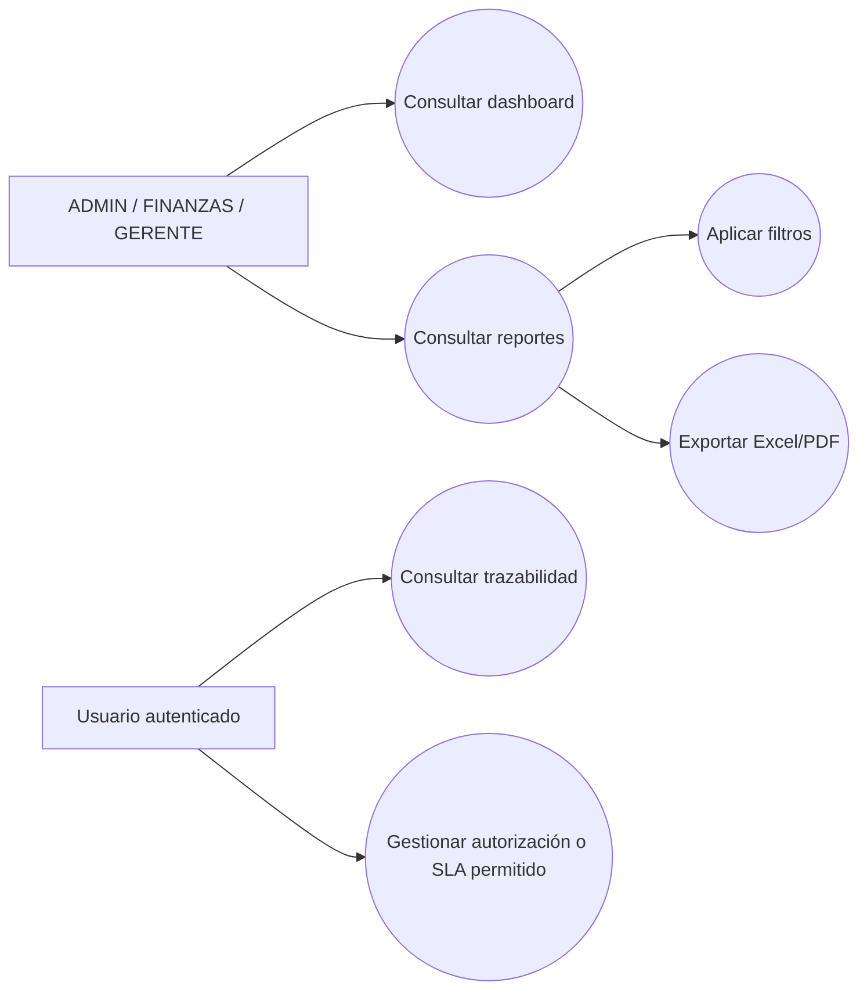
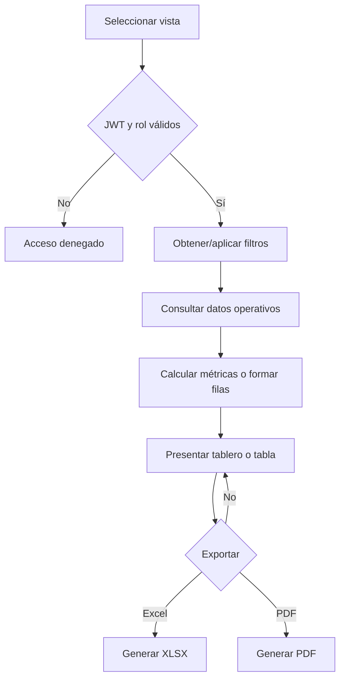
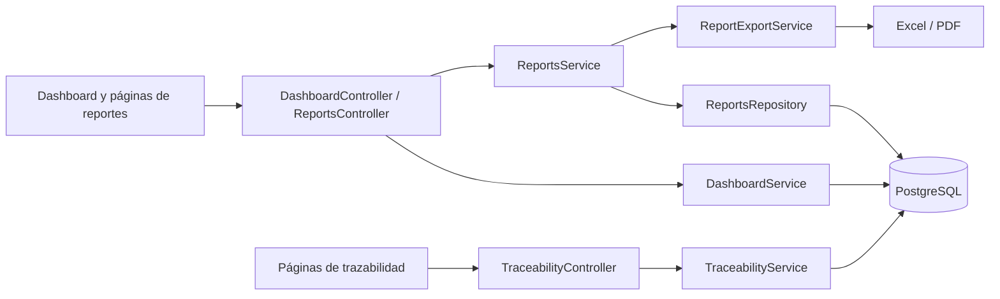

# Iteración VII — Reportes y Trazabilidad

## 1 Objetivo de la Iteración

Consolidar la consulta ejecutiva de la operación OPEX mediante tableros, reportes filtrables, exportaciones y vistas de trazabilidad, utilizando los datos generados por presupuesto, solicitudes, aprobaciones, políticas, OCR y liquidaciones.

## 2 Requerimientos generales del módulo

- Presentar indicadores ejecutivos y tendencias con filtros compartidos.
- Consultar reportes de presupuesto, solicitudes, aprobaciones, políticas y OCR.
- Exportar reportes implementados a Excel o PDF.
- Consultar autorizaciones, estados, escalaciones SLA y bitácoras de eventos.
- Restringir dashboard y reportes a `ADMIN`, `FINANZAS` y `GERENTE`.
- Mantener la trazabilidad sobre los registros operativos y de auditoría existentes.

## 3 Actores involucrados

| Actor | Participación implementada |
|---|---|
| Administrador | Accede a dashboard, reportes y vistas autorizadas de trazabilidad. |
| Finanzas | Analiza ejecución presupuestaria, solicitudes y resultados operativos. |
| Gerente | Consulta indicadores y reportes ejecutivos. |
| Usuario autenticado | Accede a las operaciones de trazabilidad que el servicio filtra según su contexto. |

## 4 Caso de Uso General

**CU-VII-01 — Consultar información gerencial y trazabilidad.** El actor abre un tablero o reporte, aplica filtros y consulta métricas o registros. Cuando requiere distribución externa, solicita la exportación Excel o PDF. En trazabilidad puede consultar autorizaciones, el monitor de estados, escalaciones SLA y eventos de una solicitud.

## 5 Descripción funcional del módulo

`DashboardService` construye resúmenes, datos presupuestarios, workflow, políticas, aprobaciones, gráficos y tendencias. `ReportsService` y `ReportsRepository` producen consultas tabulares y ejecutivas; `ReportExportService` transforma el resultado en XLSX o PDF. `TraceabilityService` reúne las acciones de autorización y las consultas de estado, SLA y eventos. El frontend expone páginas específicas y componentes reutilizables de filtros y tablas.

No existe una única tabla universal de auditoría: la evidencia se conserva en trazas y auditorías especializadas, como `ExpenseRequestTrace`, `SettlementAudit`, `SecurityAudit`, `OCRComplianceDecision`, `BankAccountAudit` y `ExchangeRateAudit`.

## 6 Secuencia normal

1. El usuario autenticado abre Dashboard o Reportes.
2. Los guards verifican el JWT y, en dashboard/reportes, uno de los roles autorizados.
3. El frontend solicita filtros y el conjunto de datos requerido.
4. El backend consulta las tablas operativas mediante Prisma y calcula indicadores.
5. La interfaz presenta tarjetas, gráficos o tablas.
6. El usuario puede modificar filtros sin alterar los datos de origen.
7. Si solicita exportación, el backend genera un archivo Excel o PDF con fecha, usuario y filtros.
8. En Trazabilidad, el usuario consulta el estado o los eventos registrados de una solicitud.

## 7 Flujos alternativos

- El reporte puede consultarse sin filtros o limitarse por los criterios definidos en `ReportQueryDto`.
- La vista ejecutiva consolida resultados de varios dominios; los demás reportes se concentran en un dominio.
- La trazabilidad permite aprobar, rechazar u observar autorizaciones y escalar un caso SLA con comentario opcional.
- Los reportes pueden permanecer en pantalla sin necesidad de exportarse.

## 8 Excepciones

- Un usuario sin rol permitido recibe denegación en dashboard y reportes.
- Un formato distinto de `excel` o `pdf` produce `BadRequestException`.
- Un identificador inexistente o no visible para el usuario no debe exponer detalles de trazabilidad.
- Un conjunto vacío se representa como estado sin resultados, no con datos simulados.

## 9 Reglas de negocio

- Dashboard y reportes requieren `ADMIN`, `FINANZAS` o `GERENTE`.
- Las exportaciones reutilizan exactamente la carga producida por `ReportsService`.
- Los archivos incluyen usuario, fecha y filtros aplicados.
- Los indicadores se calculan desde información persistida; no se almacenan cifras simuladas.
- Las bitácoras son evidencia histórica y se consultan sin sustituir las auditorías especializadas.
- Las acciones sobre autorizaciones y SLA quedan sujetas a las validaciones de `TraceabilityService`.

## 10 Diagrama de Casos de Uso



## 11 Diagrama de Flujo



## 12 Diagrama de Componentes



## 13 Mockups del módulo

Se reutilizan las pantallas reales del frontend: dashboard ejecutivo, reportes de presupuesto, solicitudes, aprobaciones, políticas y OCR; además del monitor de estados, escalaciones SLA y bitácora de eventos. Los componentes `ReportFilters` y `ReportTable` uniforman filtros y resultados. Este documento no incorpora imágenes inventadas; las rutas y componentes implementados constituyen el mockup verificable.

## 14 Fragmentos principales del código implementado

Control de acceso y consulta de reportes:

```ts
@Controller('reports')
@UseGuards(JwtAuthGuard, RolesGuard)
@Roles('ADMIN', 'FINANZAS', 'GERENTE')
export class ReportsController {
  @Get('budget') budget(@Query() filters: ReportQueryDto) {
    return this.reports.budget(filters);
  }
}
```

Validación del formato de exportación:

```ts
const isExcel = format === 'excel';
if (!isExcel && format !== 'pdf') {
  throw new BadRequestException('Formato de exportación no válido.');
}
```

## 15 Objetos creados

- **Entidades:** se consultan entidades operativas y de auditoría existentes; el módulo no define una entidad única de reporte.
- **DTO:** `ReportQueryDto`, tipos de filtros del dashboard.
- **Controllers:** `DashboardController`, `ReportsController`, `TraceabilityController`.
- **Services:** `DashboardService`, `ReportsService`, `ReportExportService`, `TraceabilityService`.
- **Repositories:** `ReportsRepository`.
- **Hooks:** hooks y consultas de las páginas de reportes según la capa frontend existente.
- **Componentes:** `ExecutiveDashboardPage`, páginas `*ReportPage`, `ReportPage`, `ReportFilters`, `ReportTable`, páginas de monitor, SLA y eventos.
- **Interfaces:** `ExportPayload`, columnas y tipos de reportes, filtros del dashboard.
- **Guards:** `JwtAuthGuard`, `RolesGuard`.
- **Middlewares:** infraestructura HTTP global existente; no se creó middleware propio para reportes.

## 16 Base de datos

Los cálculos leen, entre otras, las tablas de solicitudes, aprobaciones, presupuestos, políticas y documentos OCR. La trazabilidad utiliza `ExpenseRequestTrace` y los modelos de workflow; las auditorías especializadas incluyen `SettlementAudit`, `SecurityAudit`, `OCRComplianceDecision`, `BankAccountAudit` y `ExchangeRateAudit`. Las migraciones que introdujeron cada dominio son las mismas documentadas en las iteraciones anteriores; no existe una migración exclusiva necesaria para presentar los reportes actuales.

## 17 API REST

| Método | Ruta | Función |
|---|---|---|
| GET | `/api/dashboard/summary` | Resumen ejecutivo. |
| GET | `/api/dashboard/budget` | Indicadores presupuestarios. |
| GET | `/api/dashboard/workflow` | Indicadores del flujo. |
| GET | `/api/dashboard/policies` | Indicadores de políticas. |
| GET | `/api/dashboard/approvals` | Indicadores de aprobaciones. |
| GET | `/api/dashboard/charts` | Datos para gráficos. |
| GET | `/api/dashboard/trends` | Tendencias. |
| GET | `/api/dashboard/filters` | Catálogos de filtros. |
| GET | `/api/reports/filters` | Filtros de reportes. |
| GET | `/api/reports/budget` | Reporte presupuestario. |
| GET | `/api/reports/requests` | Reporte de solicitudes. |
| GET | `/api/reports/approvals` | Reporte de aprobaciones. |
| GET | `/api/reports/policies` | Reporte de políticas. |
| GET | `/api/reports/executive` | Reporte ejecutivo. |
| GET | `/api/reports/ocr` | Reporte OCR. |
| GET | `/api/reports/:kind/export/:format` | Exportación `excel` o `pdf`. |
| GET | `/api/traceability/authorizations` | Autorizaciones pendientes. |
| POST | `/api/traceability/authorizations/:id/approve` | Aprobar autorización. |
| POST | `/api/traceability/authorizations/:id/reject` | Rechazar autorización. |
| POST | `/api/traceability/authorizations/:id/observe` | Observar autorización. |
| GET | `/api/traceability/status-monitor` | Monitor general. |
| GET | `/api/traceability/status-monitor/:id` | Detalle del monitor. |
| GET | `/api/traceability/sla-escalations` | Escalaciones SLA. |
| POST | `/api/traceability/sla-escalations/:id/escalate` | Ejecutar escalación. |
| GET | `/api/traceability/event-logs` | Bitácora general. |
| GET | `/api/traceability/event-logs/:requestId` | Eventos de una solicitud. |

## 18 Pruebas realizadas

El inventario actual no contiene una especificación unitaria dedicada exclusivamente a `ReportsService` o `DashboardService`. Su compatibilidad se valida mediante la compilación del backend/frontend y las pruebas de regresión de los dominios que alimentan sus métricas. Las exportaciones implementadas aceptan Excel y PDF y rechazan otros formatos desde el controller. Esta ausencia de pruebas unitarias específicas se registra como cobertura pendiente, sin atribuir pruebas inexistentes.

## 19 Resultado de la Iteración

Quedaron implementados el dashboard ejecutivo, seis familias de reportes consultables, exportación XLSX/PDF y las vistas de autorizaciones, monitor de estados, SLA y eventos. El resultado integra la información producida por los módulos anteriores y conserva la separación entre indicadores, operación y auditorías especializadas.
